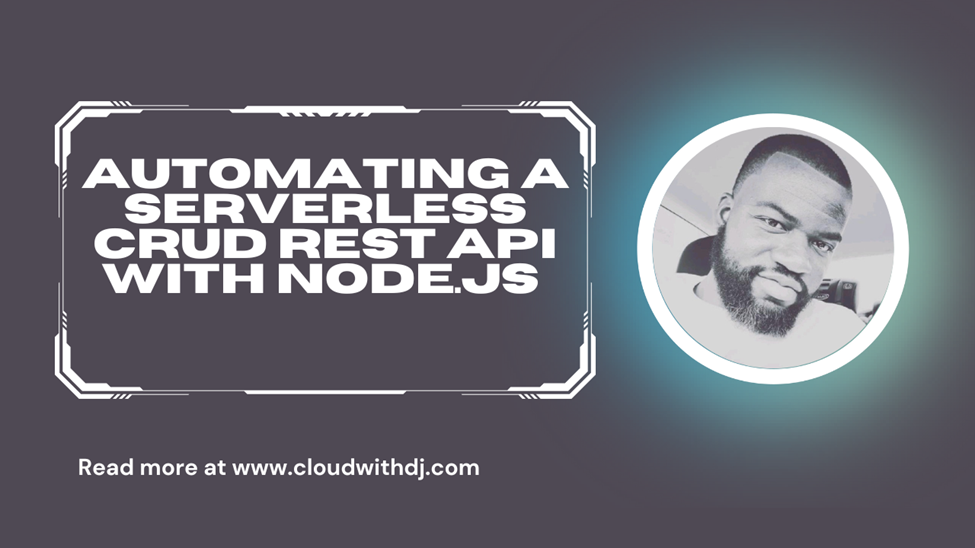

# Automating a Serverless CRUD REST API with Node.js - Use Case: Coffee Shop

In this guide, I walk you through building and automating the deployment of a **serverless CRUD REST API using Node.js, AWS Lambda, API Gateway, DynamoDB, Serverless Framework, and GitHub Actions CI/CD.**

I’ll build a Coffee Shop API to manage orders, inventory, and customer requests, deploying it automatically whenever code changes are pushed.

## Prerequisites

* Node.js and npm installed

* AWS CLI configured for your AWS account

* Serverless Framework account and CLI installed globally
 

## Objectives

1. Set up the Serverless Framework environment

2. Define the API in `serverless.yml`

3. Create Lambda functions for CRUD operations

4. Configure multi-stage deployments (dev/prod)

5. Automate deployments with GitHub Actions CI/CD

6. Test APIs with Postman

 
## Step 0 – Clone the Repository

Clone the project from GitHub and review the included files. You’ll use them to build the Coffee Shop API.

 

## Step 1 – Set Up Serverless Framework

* Log in to your Serverless account

* Create an **access key** in the Access Keys section

* Save it securely and add it as `SERVERLESS_ACCESS_KEY` in your GitHub repository secrets

This key lets the CI/CD pipeline authenticate with Serverless during deployments.

 

## Step 2 – Define API in `serverless.yml`

Configuration includes:

* **AWS** as the provider with **Node.js** runtime

* Region (`us-east-1`) and dynamic `stage` (dev/prod)

* IAM permissions for Lambda to access DynamoDB

* Four Lambda functions:

  * `createCoffee`
  * `getCoffee`
  * `updateCoffee`
  * `deleteCoffee`

* A DynamoDB table with pay-per-request billing

Dynamic naming ensures resources are separate for dev and prod (e.g., `CoffeeOrders-dev` vs. `CoffeeOrders-prod`).

 
## Step 3 – Build Lambda Functions

Each function uses AWS SDK and DynamoDB DocumentClient:

* **Create Coffee** – Adds a new coffee order with a unique `OrderId`

* **Get Coffee** – Retrieves all orders

* **Update Coffee** – Updates order details or status

* **Delete Coffee** – Cancels an order by ID and customer name

 

## Step 4 – Configure CI/CD with GitHub Actions

1. In GitHub: **Settings → Secrets and variables → Actions**

2. Add:

   * `AWS_ACCESS_KEY_ID`
   * `AWS_SECRET_ACCESS_KEY`
   * `SERVERLESS_ACCESS_KEY`

3. Use `main` for production and `dev` for development

4. Workflow automates:

   * Installing Node.js & dependencies

   * Installing Serverless Framework

   * Deploying to **dev** on `dev` branch push

   * Deploying to **prod** on `main` branch push

 

## Step 5 – Test the Pipelines

* Push changes to `dev` → Deploys to dev environment

* Merge into `main` → Deploys to production

* Monitor deployment logs in the **Actions** tab

 

## Step 6 – Test APIs with Postman

1. Get API URLs from GitHub Actions logs

2. **GET** – Initially returns an empty list of coffee orders

3. **POST** – Creates a new coffee order with customer and blend details

4. **PUT** – Updates order status (e.g., “Ready”)

5. **DELETE** – Cancels an order

Verify each operation by checking DynamoDB tables for the correct environment.

 

Voila! **You’ve now built and automated a fully serverless CRUD REST API** for a coffee shop, using AWS Lambda, API Gateway, DynamoDB, Serverless Framework, and GitHub Actions—scalable, cost-efficient, and maintenance-free.

<!--  -->

Find the detailed tutorial, with screenshot and tips, on my website: [Automating a Serverless CRUD REST API with Node.js](https://cloudwithdj.com/automating-a-serverless-crud-rest-api-with-node-js/)

